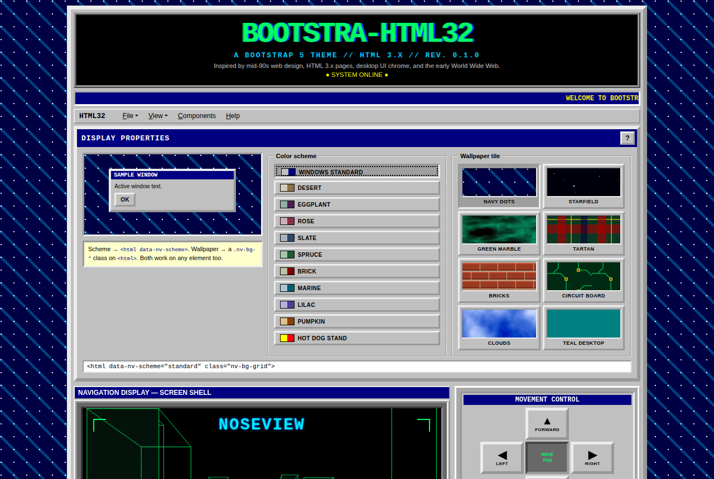
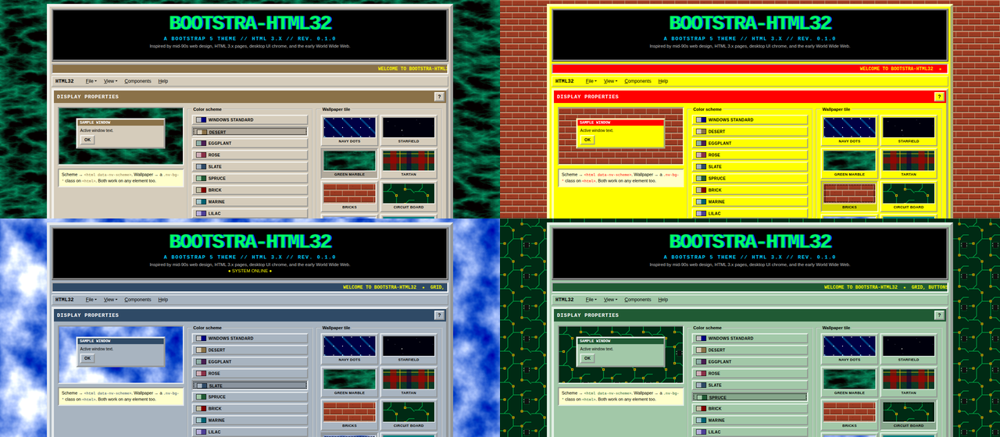

# bootstra-html32

A Bootstrap 5 theme inspired by mid-90s web design, HTML 3.x pages, desktop UI chrome, and the early World Wide Web.

Outset buttons that press in. Navy title bars. Phosphor-green terminal blocks. A marquee ticker, a visitor counter and a tiled wallpaper behind it all. Underneath, it's still Bootstrap 5.3: the grid, utilities, components and JavaScript plugins work exactly as documented. Only the look changes.



**[▶ Live demo](https://bloschinsky.github.io/bootstra-html32/)**

## Install

The theme is a single CSS file with no images, fonts or JavaScript. Load Bootstrap 5.3 first, then the theme, using any of the options below.

### CDN (versioned)

```html
<link rel="stylesheet" href="https://cdn.jsdelivr.net/npm/bootstrap@5.3.3/dist/css/bootstrap.min.css">
<link rel="stylesheet" href="https://cdn.jsdelivr.net/npm/bootstra-html32@0.1/dist/bootstra-html32.min.css">
```

### npm

```sh
npm install bootstrap bootstra-html32
```

Then link or import `node_modules/bootstra-html32/dist/bootstra-html32.min.css` after Bootstrap's stylesheet.

Bootstrap is a peer dependency (`^5.3.0`): npm 7 and later installs it automatically if your project does not have it yet, and reuses your project's copy if it does, so only one Bootstrap ends up in the page.

### Latest build from GitHub Pages

The demo site also serves the current build from `master`. It always follows the latest commit and cannot be pinned to a version, so use it for prototypes rather than long-lived pages.

```html
<link rel="stylesheet" href="https://bloschinsky.github.io/bootstra-html32/dist/bootstra-html32.min.css">
```

### Copy the file into your project

Download [`bootstra-html32.min.css`](https://bloschinsky.github.io/bootstra-html32/dist/bootstra-html32.min.css) (or the readable [`bootstra-html32.css`](https://bloschinsky.github.io/bootstra-html32/dist/bootstra-html32.css)) and keep it next to your own code, for example in `assets/vendor/`. The file is self-contained, and its version is in the banner comment at the top.

### Build from source

```sh
git clone https://github.com/bloschinsky/bootstra-html32.git
cd bootstra-html32
npm ci
npm run build   # dist/bootstra-html32.css and dist/bootstra-html32.min.css
```

### Unbuilt source (quick experiments only)

`src/bootstra-html32.css` pulls in its partials with plain CSS `@import`, so a browser can load it without a build. This makes 15 requests and is not minified:

```html
<link rel="stylesheet" href="https://cdn.jsdelivr.net/gh/bloschinsky/bootstra-html32@master/src/bootstra-html32.css">
```

### Set up the page

Pick a colour scheme and a wallpaper on `<html>`:

```html
<html data-nv-scheme="standard" class="nv-bg-grid">
```

Then wrap the page in `.nv-page` and write normal Bootstrap markup. See [`examples/starter.html`](examples/starter.html) for a minimal page.

Built files:

| File | Use |
| --- | --- |
| `bootstra-html32.css` | Readable build with comments |
| `bootstra-html32.min.css` | Minified build |

## Colour schemes

Like the Appearance tab in Windows, every component keeps its shape while the palette changes. Set `data-nv-scheme` on `<html>`, or on any element to recolour just that part of the page.



| Value | Face | Title bar |
| --- | --- | --- |
| `standard` | `#c0c0c0` | `#000080` |
| `desert` | `#d5ccbb` | `#8a7148` |
| `eggplant` | `#90b0a8` | `#4b1f53` |
| `rose` | `#cfafb7` | `#8a3048` |
| `slate` | `#a8b4c0` | `#2f4a66` |
| `spruce` | `#a2c8a8` | `#205a34` |
| `brick` | `#c2bfa5` | `#800000` |
| `marine` | `#a8c8cc` | `#006070` |
| `lilac` | `#b8b0dc` | `#4e3f96` |
| `pumpkin` | `#e0c28c` | `#8a4000` |
| `hotdog` | `#ffff00` | `#ff0000` |

### Make your own

A scheme is two colours. Highlights, shadows and pressed states are derived with `color-mix()`:

```css
[data-nv-scheme="cyber"] {
  --nv-face: #b4b4c8; --nv-face-rgb: 180,180,200;
  --nv-title: #5a005a; --nv-title-rgb: 90,0,90;
}
```

The `-rgb` variants feed Bootstrap utilities such as `.bg-primary` and `.text-bg-primary`.

## Wallpapers

Repeating tiles drawn with CSS gradients and inline SVG, so no image files ship. Put one class on `<html>`. The classes also work on any element, which is handy for thumbnails.

| Class | Tile |
| --- | --- |
| `nv-bg-grid` | Navy with white dots and diagonal stripes (default) |
| `nv-bg-stars` | Pixel starfield |
| `nv-bg-marble` | Green marble |
| `nv-bg-tartan` | Tartan plaid |
| `nv-bg-bricks` | Red brick wall |
| `nv-bg-circuit` | Circuit board |
| `nv-bg-clouds` | Blue sky with clouds |
| `nv-bg-teal` | Plain teal desktop |

## Bootstrap components

All of these are restyled and need no extra classes: buttons and button groups, forms (inputs, selects, checks, radios, switches, ranges, input groups, validation), cards, tables, nav tabs and pills, navbar, dropdowns, breadcrumbs, pagination, alerts, badges, progress bars, spinners, list groups, accordion, modals, offcanvas, toasts, tooltips and popovers.

A few variants have a 90s meaning:

| Markup | Result |
| --- | --- |
| `.btn` | Grey outset button |
| `.btn-primary` | Button in the title-bar colour |
| `.btn-success` or `.btn-terminal` | Black button with green phosphor text |
| `.btn-xl` | Tall control-panel button |
| `.btn-check` + `.btn.nv-led` | Toggle that lights green when on |
| `.btn-close` | Square title-bar "X" button |
| `.card` | Sunken panel with a title strip as `.card-header` |
| `.card.nv-window` | Raised window with a drop shadow |
| `.table` | White table with bevelled cells and a title-colour header |
| `.table.table-terminal` | Black status table with green text |
| `.alert` | Yellow note box (colour variants included) |
| `.alert.alert-terminal.alert-*` | Glowing CRT warning |
| `.progress` | Segmented block progress bar |
| `.progress.nv-solid` | Solid bar that can show a percentage |
| `.progress.nv-meter` (`.nv-meter-hull`, `-fuel`, `-amber`) | Thin glowing gauge |
| `.badge.nv-led` / `.badge.nv-bevel` | LED or raised badge |
| `.form-control.nv-crt` | Black terminal input |

## Theme components

| Class | What it is |
| --- | --- |
| `.nv-page` | Centred outset page frame (1040 px; `.nv-page-narrow` is 720 px) |
| `.nv-masthead`, `.nv-logo`, `.nv-subtitle` | Black header with chromatic logo |
| `.nv-blink` | Blinking text |
| `.nv-ticker` > `.nv-ticker-track` | Marquee strip |
| `.navbar.nv-menubar` | File / Edit / View menu bar |
| `.nv-box-title`, `.nv-label`, `.nv-label-crt` | Title strips |
| `.nv-titlebar`, `.nv-window-body` | Window title bar and body |
| `.nv-panel`, `.nv-sidebar`, `.nv-well` | Sunken panel, ridged side column, inset group |
| `.nv-raised`, `.nv-sunken`, `.nv-ridge`, `.nv-groove` | Bevel utilities |
| `fieldset.nv-groupbox` | Group box with an inline legend |
| `.nv-help` | Yellow help note |
| `.nv-terminal` | Green-on-black text block (`.nv-hot`, `.nv-cool`, `.nv-cursor`) |
| `.nv-screen-shell` > `.nv-screen` | Frame for a canvas, video or image at 4:3 |
| `.nv-hud`, `.nv-corner-*`, `.nv-crosshair`, `.nv-hud-title`, `.nv-hud-bl/br` | HUD overlay pieces |
| `.nv-scanlines`, `.nv-overlay-msg` | CRT scanlines and an on-screen message |
| `.nv-dpad` | 3×3 direction pad (`.nv-dpad-up/left/right/down/center`) |
| `.nv-counter` | Visitor counter |
| `.nv-button88` | 88×31 web badge |
| `.nv-construction`, `.nv-construction-label` | Under-construction strip and sign |
| `.nv-new`, `.nv-rainbow` | Flashing NEW! tag and rainbow text |
| `.nv-footer` | Centred small-print footer |

The [demo page](https://bloschinsky.github.io/bootstra-html32/) (`site/index.html`) shows every component in use and doubles as the documentation.

## Accessibility and motion

Focus is shown with a dotted outline, in keeping with the era. Blinking text, the ticker, the cursor and NEW! tags stop when the visitor's system asks for reduced motion. On narrow screens, borders get thinner and the D-pad stretches to fit.

## Browser support

Any current browser that supports `color-mix()`: Chrome / Edge 111+, Firefox 113+, Safari 16.2+.

## Development

```
src/        theme source, one partial per section, bundled from bootstra-html32.css
site/       demo page published to GitHub Pages
examples/   starter template
scripts/    build script
```

`dist/` and `_site/` are build output and are not committed.

```sh
npm install
npm run dev     # build, watch and serve the demo on http://localhost:8080
npm run build   # dist/ (readable + minified CSS) and _site/ (demo page)
npm run lint    # stylelint
```

The demo is deployed to GitHub Pages by the `pages.yml` workflow on every push to `master`.

To release, move the `Unreleased` notes in `CHANGELOG.md` under a new version heading, then:

```sh
npm version minor   # bumps package.json, commits and tags vX.Y.Z
git push --follow-tags
```

The `release.yml` workflow checks that the tag matches `package.json`, runs lint and build, publishes to npm with provenance (trusted publishing, no token) and creates a GitHub Release with the CSS files attached.

## Credits

Created by [Artem Bloschinsky](https://github.com/bloschinsky). The visual language comes from the interface of [NOSEVIEW 1997](https://github.com/bloschinsky/noseview-city-1997). Built on [Bootstrap](https://getbootstrap.com/) (MIT).

## License

[MIT](LICENSE)
